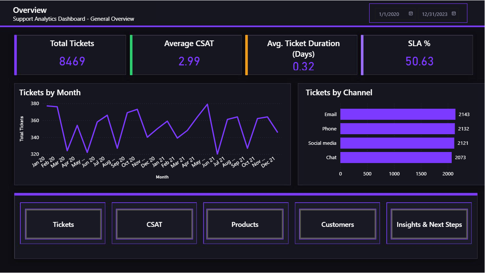
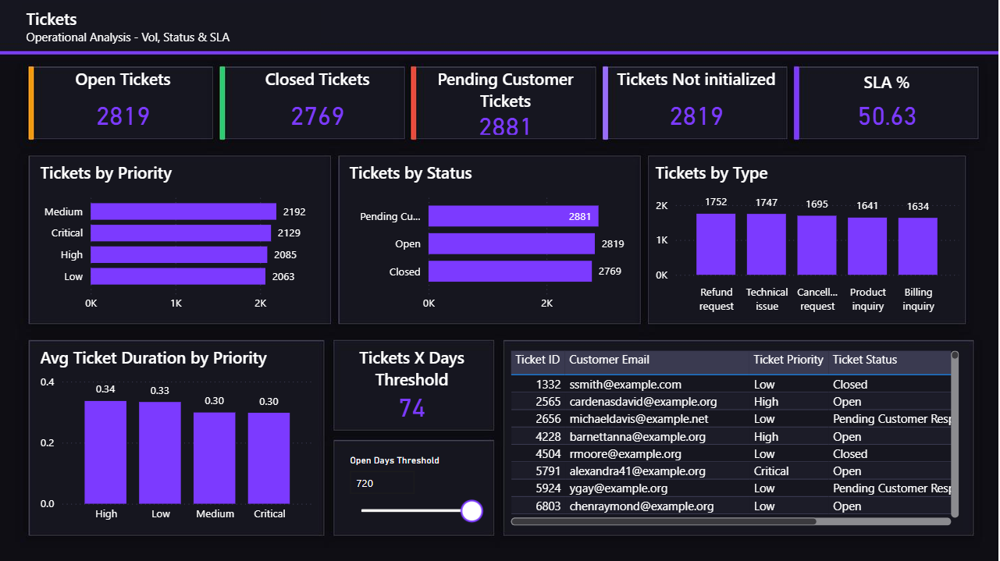
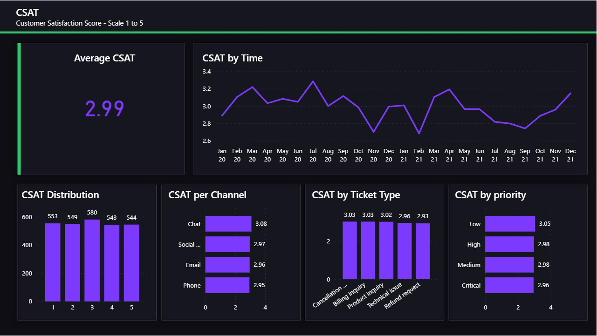
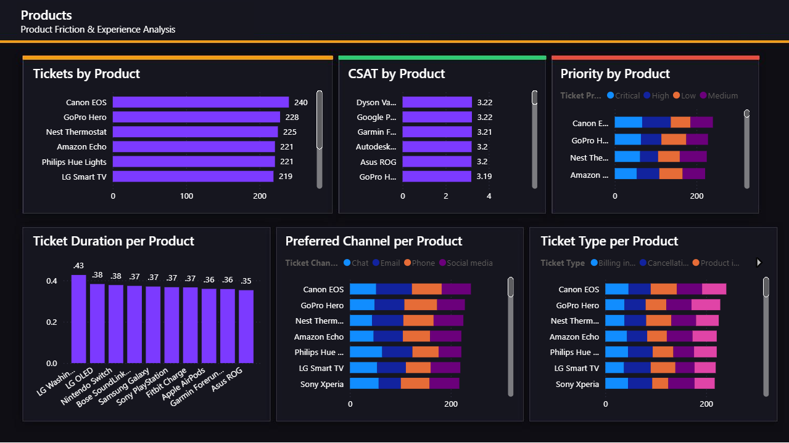
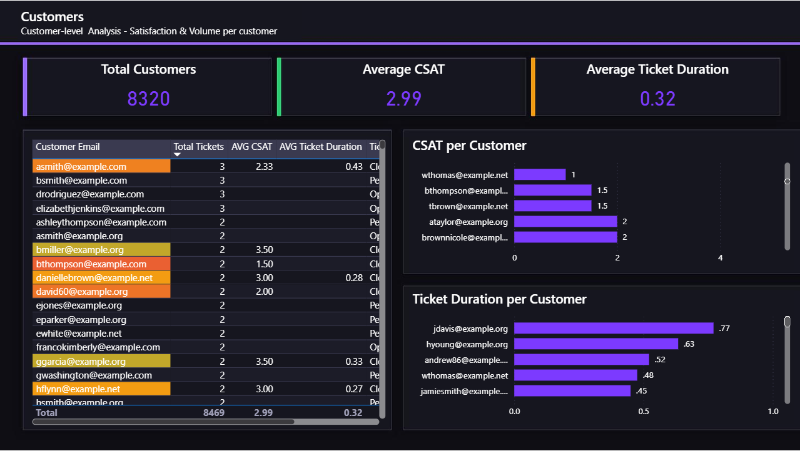
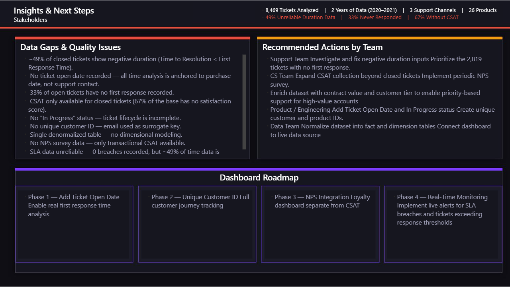

# 📊 Customer Support Analytics Dashboard

> Power BI dashboard built for portfolio purposes, analyzing customer support ticket data from a Kaggle dataset. The project covers the full analytical workflow — from data quality assessment to actionable insights for decision-makers.

---

## 📁 Project Structure

```
Customer Support Ticket Dataset/
├── Backgrounds/        # PNG backgrounds used in Power BI pages
├── Dashboard/          # Power BI .pbix file
├── Data/               # Original dataset (CSV)
├── Images/             # Dashboard screenshots
└── README.md
```

---

## 🗂️ Dashboard Pages

| Page | Description |
|------|-------------|
| **Overview** | Executive summary with key KPIs, monthly trend and navigation |
| **Tickets** | Operational analysis — volume, status, priority and SLA |
| **CSAT** | Customer satisfaction score analysis — scale 1 to 5 |
| **Products** | Friction and experience analysis by product |
| **Customers** | Individual customer analysis — volume and satisfaction |
| **Insights & Next Steps** | Data quality findings and recommendations for stakeholders |

---

## 📸 Dashboard Preview

### Overview


### Tickets


### CSAT


### Products


### Customers


### Insights & Next Steps


---

## 🛠️ Tools & Technologies

- **Power BI Desktop** — dashboard development
- **DAX** — calculated measures and columns
- **Power Query (M)** — data transformation
- **PowerPoint** — background layout design

---

## 📐 Data Model

The dataset is a single denormalized table containing all support ticket information. A **Calendar table** was created via DAX (`CALENDARAUTO()`) and connected to the fact table through `Date of Purchase`.

A dedicated `_Measures` table was created to organize all DAX measures.

**Key measures created:**

| Measure | Description |
|---------|-------------|
| `01 Total Tickets` | Total row count |
| `02 Open Tickets` | Tickets with status = Open |
| `03 Closed Tickets` | Tickets with status = Closed |
| `04 Pending Tickets` | Tickets with status = Pending Customer Response |
| `05 AVG CSAT` | Average customer satisfaction rating |
| `06 AVG Ticket Duration` | Average resolution time (positive values only) |
| `07 SLA %` | % of closed tickets resolved within SLA threshold |
| `08 Tickets Not Initialized` | Tickets with no First Response Time recorded |
| `09 Tickets +X Days Without Resolution` | Dynamic count based on threshold slicer |

---

## ⚠️ Data Quality Findings

During the analysis, several data quality issues were identified and documented:

1. **~49% of closed tickets show negative duration** — Time to Resolution is earlier than First Response Time, indicating input errors in the source system.
2. **No ticket open date recorded** — all time-based analysis is anchored to `Date of Purchase`, not the actual support contact date.
3. **33% of open tickets have no first response** — 2,819 tickets were never attended.
4. **CSAT only available for closed tickets** — 67% of the base (5,700 tickets) has no satisfaction score.
5. **No "In Progress" status** — the ticket lifecycle is incomplete, making stage-level time analysis impossible.
6. **No unique customer ID** — customer email was used as a surrogate key with documented caveats.
7. **Single denormalized table** — no dimensional modeling; product, customer and channel IDs are absent.
8. **No NPS data** — only transactional CSAT is available; customer loyalty cannot be measured.
9. **SLA reliability** — 0 breaches recorded, but ~49% of time data is inconsistent, making this metric unreliable.

---

## 📋 Recommended Actions by Team

| Team | Action |
|------|--------|
| **Support** | Investigate negative duration inputs · Prioritize 2,819 tickets with no first response |
| **CS** | Expand CSAT collection beyond closed tickets · Implement periodic NPS survey |
| **Product / Engineering** | Add Ticket Open Date and "In Progress" status · Create unique customer and product IDs |
| **Data** | Normalize dataset into fact and dimension tables |
| **CS / CRM** | Enrich dataset with contract value and customer tier to enable priority-based support for high-value accounts |

---

## 🗺️ Dashboard Roadmap

| Phase | Goal |
|-------|------|
| **Phase 1** | Add Ticket Open Date — enable real first response time analysis |
| **Phase 2** | Unique Customer ID — full customer journey tracking |
| **Phase 3** | NPS Integration — loyalty dashboard separate from CSAT |
| **Phase 4** | Real-Time Monitoring — live alerts for SLA breaches and response thresholds |

---

## 📦 Dataset

- **Source:** [Customer Support Ticket Dataset — Kaggle](https://www.kaggle.com/datasets/suraj520/customer-support-ticket-dataset)
- **Period:** 2020–2021
- **Volume:** 8,469 tickets · 26 products · 4 support channels
- **Author:** suraj520

---

## 👤 Author

**Marcelo Nepomuceno Marcos** — Data Analytics Portfolio  
[LinkedIn](https://www.linkedin.com/in/marcelonepomuceno/) 
[GitHub](https://github.com/MarceloNMarcos)

> *This project was built for learning and portfolio purposes. All analysis decisions, data quality findings and recommendations were developed independently based on the dataset exploration.*